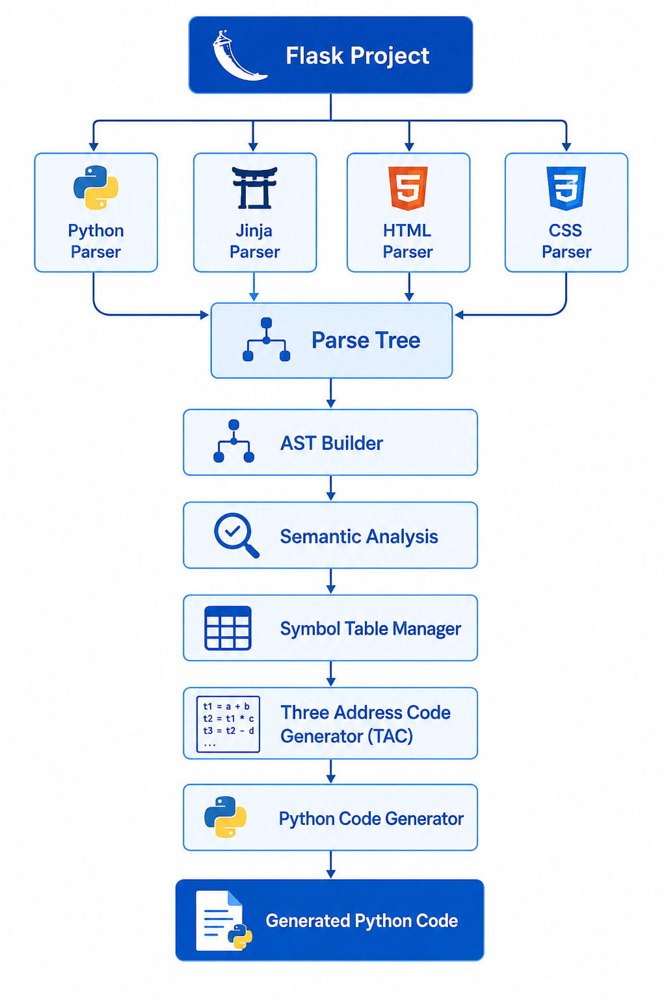
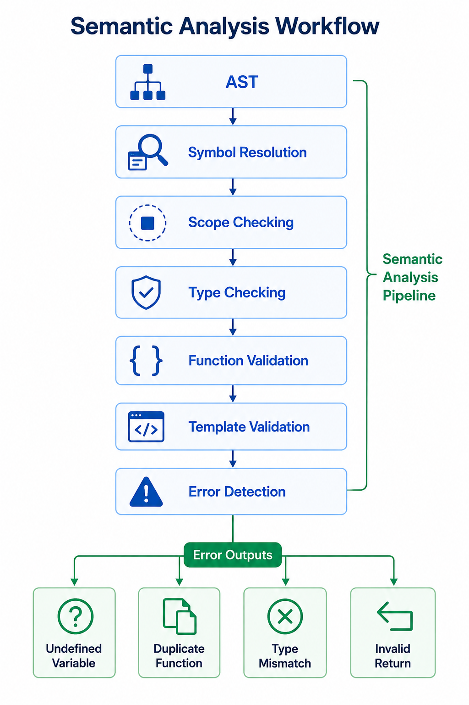
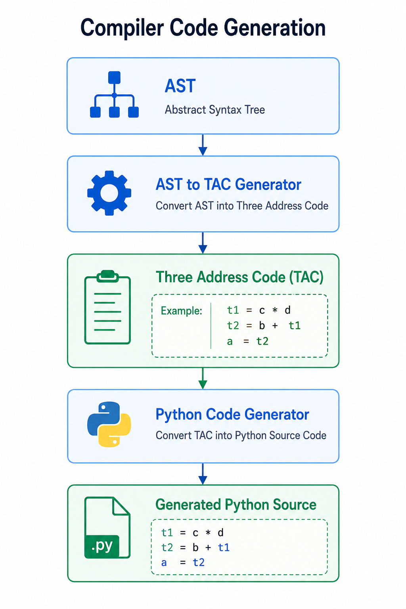

# Flask Compiler

<div align="center">


### A Multi-Language Compiler and Static Analysis Framework for Flask Applications

Parse • Analyze • Validate • Generate

</div>

---

# Table of Contents

* Overview
* Motivation
* Features
* Architecture
* Compiler Pipeline
* Project Structure
* Semantic Analysis Engine
* Symbol Table Management
* Intermediate Representation (TAC)
* Code Generation
* Error Detection System
* Installation
* Building the Project
* Running the Compiler
* Testing
* Example Workflow
* Future Improvements

---

# Overview

Flask Compiler is a research-oriented compiler framework designed to analyze Flask web applications.

Unlike traditional compilers that focus on a single language, this project supports multiple technologies commonly found in Flask applications:

* Python
* Jinja2 Templates
* HTML
* CSS

The compiler parses source files, constructs Abstract Syntax Trees (ASTs), performs semantic validation, manages scopes and symbol tables, detects programming errors, generates Three Address Code (TAC), and finally produces executable Python output.

---

# Motivation

Modern Flask applications are composed of several interconnected technologies.

Traditional static analyzers typically analyze Python code only.

This compiler extends analysis to:

* Flask route handlers
* Template variables
* HTML structures
* CSS definitions
* Cross-file semantic consistency

The goal is to provide a unified analysis framework capable of understanding the entire Flask application.

---

# Key Features

## Parsing

* Python Grammar
* Jinja Grammar
* HTML Grammar
* CSS Grammar

## Semantic Analysis

* Undefined Variable Detection
* Duplicate Symbol Detection
* Function Validation
* Type Consistency Checking
* Return Validation
* Scope Resolution
* Template Variable Validation
* Template Existence Checking

## Intermediate Representation

* Three Address Code (TAC)
* Control Flow Representation
* Expression Decomposition

## Code Generation

* AST → TAC
* TAC → Python

## Error Reporting

* Syntax Errors
* Semantic Errors
* Scope Violations
* Template Errors

---

# Architecture

```text
                    ┌─────────────────┐
                    │ Flask Project   │
                    └────────┬────────┘
                             │
            ┌────────────────┼────────────────┐
            │                │                │
            ▼                ▼                ▼

      Python Files      Templates       HTML / CSS
            │                │                │
            ▼                ▼                ▼

         ANTLR          ANTLR Parser     ANTLR Parser
         Parser

            └──────────────┬──────────────┘
                           ▼

                    Parse Trees

                           ▼

                    AST Builders

                           ▼

                 Abstract Syntax Tree

                           ▼

                Semantic Analysis Phase

                           ▼

                   Symbol Resolution

                           ▼

                     Type Checking

                           ▼

                Three Address Code

                           ▼

                Python Code Generator

                           ▼

                    Generated Code
```



---

# Compiler Pipeline

```text
Source Files
     │
     ▼
Lexical Analysis
     │
     ▼
Parsing
     │
     ▼
Parse Tree
     │
     ▼
AST Construction
     │
     ▼
Semantic Analysis
     │
     ▼
Symbol Resolution
     │
     ▼
Type Validation
     │
     ▼
TAC Generation
     │
     ▼
Python Code Generation
```

---

# Project Structure

```text
src/
│
├── antlr/
│   ├── generated parsers
│
├── ast/
│   ├── AST node definitions
│
├── visitor/
│   ├── ParseTree → AST conversion
│
├── semantic/
│   ├── Semantic analyzers
│   ├── Error detectors
│
├── symbolTable/
│   ├── Scope management
│   ├── Symbol tracking
│
├── codegen/
│   ├── TAC generation
│   ├── Python generation
│
├── listener/
│
└── app/
    └── Main application

grammars/

samples/

dependencies/
```

---

# Semantic Analysis Engine

The Semantic Analysis phase is the heart of the compiler.

Its responsibility is to ensure that the program is meaningful beyond mere syntax correctness.



---

## Semantic Checks

### Undefined Variable Detection

Example:

```python
print(x)
```

Error:

```text
Undefined Variable: x
```

---

### Duplicate Function Detection

```python
def foo():
    pass

def foo():
    pass
```

Error:

```text
Duplicate Function Declaration
```

---

### Type Validation

```python
x = 5
x = "hello"
```

Reports incompatible assignments when applicable.

---

### Return Validation

```python
return 10
```

Outside a function:

```text
Return Statement Outside Function
```

---

### Template Variable Validation

Template:

```html
{{ username }}
```

Python:

```python
render_template("index.html")
```

Error:

```text
Undefined Template Variable: username
```

---

# Symbol Table Management

The compiler uses hierarchical symbol tables.

```text
Global Scope
│
├── Function Scope
│     ├── Local Variables
│
├── Class Scope
│
└── Nested Scopes
```

Each symbol contains:

```text
Name
Type
Scope
Declaration Location
Usage Information
```

The symbol table enables:

* Name Resolution
* Scope Lookup
* Shadowing Detection
* Duplicate Detection

---

# Intermediate Representation (TAC)

The compiler translates AST nodes into Three Address Code.

Example:

```python
a = b + c * d
```

Generated TAC:

```text
t1 = c * d
t2 = b + t1
a = t2
```

Benefits:

* Easier optimization
* Simpler code generation
* Explicit control flow

---

# Code Generation

Location:

```text
src/codegen/
```

Main Components:

```text
AstToTac.java
TacInstruction.java
TacProgram.java
PythonCodeGenerator.java
```

---

## Stage 1

AST → TAC

Example:

```python
x = a + b
```

TAC:

```text
t1 = a + b
x = t1
```

---

## Stage 2

TAC → Python

Generated:

```python
x = a + b
```

This separation improves maintainability and allows future optimization passes.



---

# Error Detection System

Implemented detectors include:

| Detector                  | Purpose                   |
| ------------------------- | ------------------------- |
| Undefined Symbol          | Missing variable          |
| Duplicate Function        | Multiple declarations     |
| Duplicate Variable        | Same scope declaration    |
| Type Mismatch             | Invalid assignments       |
| Infinite Recursion        | Recursive loops           |
| Return Validator          | Invalid returns           |
| Template Checker          | Missing template files    |
| Template Variable Checker | Undefined Jinja variables |

---

# Installation

## Requirements

* Java 17+
* ANTLR 4.13.2

---

# Building

Windows

```bash
javac -cp ".;dependencies/antlr-4.13.2-complete.jar" src/**/*.java
```

Linux/macOS

```bash
javac -cp ".:dependencies/antlr-4.13.2-complete.jar" src/**/*.java
```

---

# Running

```bash
java app.App
```

or

```bash
java -cp ".;dependencies/antlr-4.13.2-complete.jar" app.App
```

---

# Testing

Sample test programs are provided under:

```text
samples/
```

These samples cover:

* Python Parsing
* Semantic Analysis
* Flask Templates
* HTML Parsing
* CSS Parsing
* Code Generation

---

# Example Workflow

```text
1. Load Flask Project

2. Parse Source Files

3. Build AST

4. Create Symbol Tables

5. Perform Semantic Analysis

6. Generate TAC

7. Generate Python Code

8. Report Errors
```

---

# Future Improvements

## Scope System

* Lambda Scope
* Closure Analysis
* Async Scope
* Exception Scope
* With Scope

## Type System

* Stronger Type Inference
* Generic Types
* Union Types

## Optimizations

* Constant Folding
* Dead Code Elimination
* Control Flow Graphs
* Data Flow Analysis

## Flask-Specific Analysis

* Route Validation
* Template Inheritance
* Blueprint Resolution
* Context Variable Tracking

---

# Educational Value

This project demonstrates concepts from:

* Compiler Construction
* Static Program Analysis
* Symbol Table Design
* Semantic Validation
* Intermediate Representations
* Code Generation
* ANTLR Parser Development

---

# Author

Flask Compiler

An academic compiler project for analyzing and translating Flask-based applications using ANTLR4 and Java.

# Team
* Ola Mohsen Faza
* Raghad Majed Al-Abdullah
* Abdul Rahman Bassam Al-Muzain
* Zainab Khalil Khalaf
* Mohammad Salim Suleiman Al-Taqi
